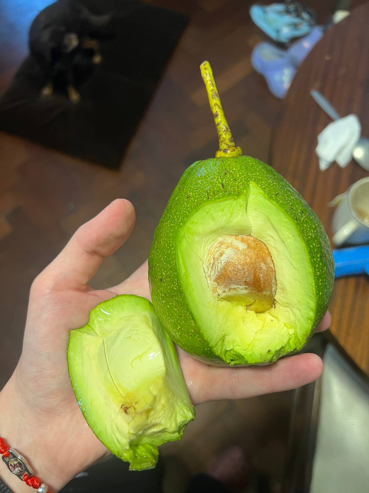
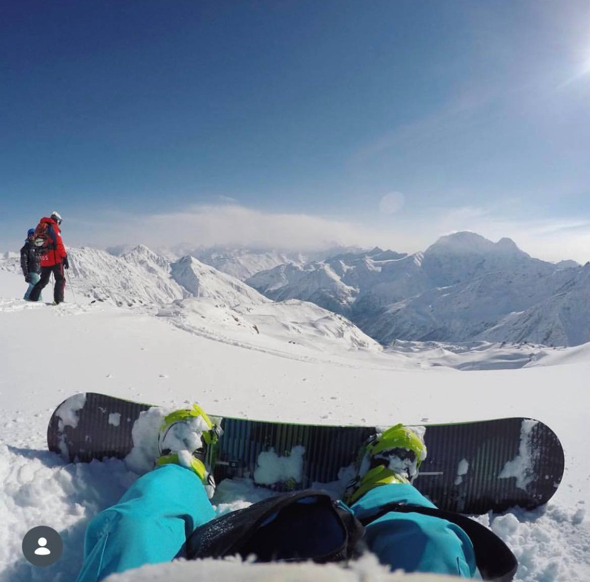
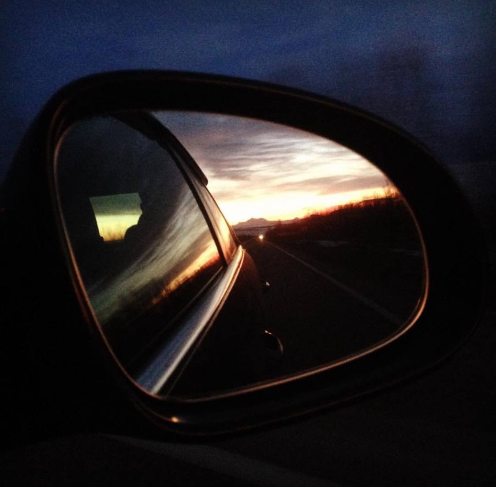
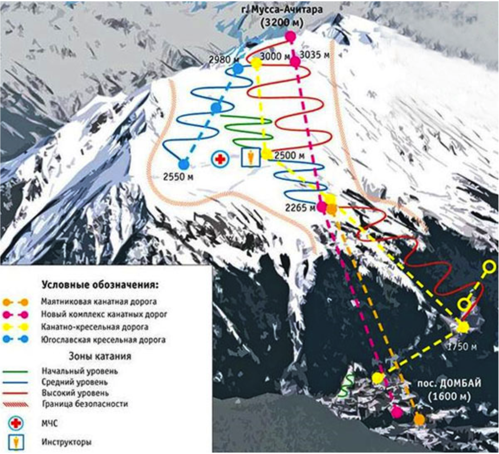
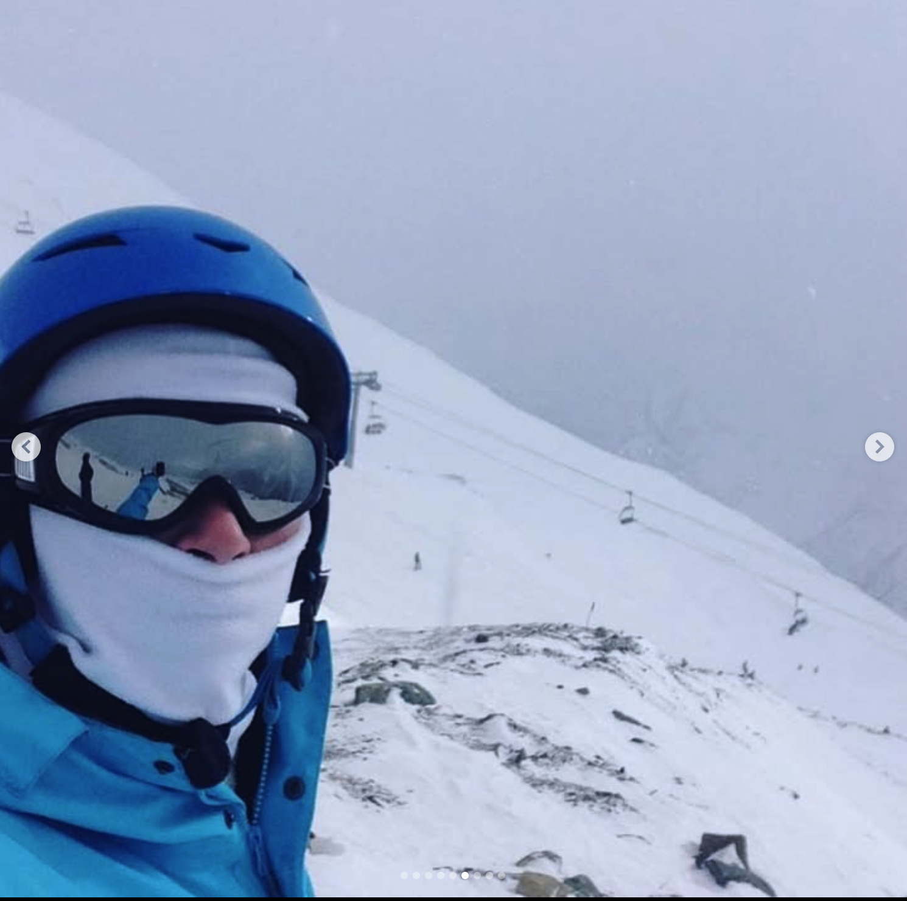

> _Да, человек смертен, но это было бы еще полбеды. Плохо то, что он иногда внезапно смертен, вот в чём фокус!_"
>
> — Михаил Булгаков / "Мастер и Маргарита

В целом, у человека один день рождения. Если исключить реинкарнацию, технически мы действительно рождаемся один раз. Но избегаем последнего дня в пределах жизни не единожды. И каждая история откладывает на нас свой отпечаток.

## Авокадо

Недавно, на самой обычной утренней прогулке с собакой, рядом с нами упал авокадо с высоты третьего этажа. В столице Аргентины это не редкость. Когда-то его высадили на территории местной школы, он прижился, благополучно рос и свалился именно в тот момент, когда мы проходили мимо. К счастью, никто не пострадал. Из чистого любопытства, я забрал его с собой, взвесил дома — вес был примерно полкило. С математикой у меня сложные отношения, но эти знания здесь и не требуются, чтобы примерно прикинуть последствия попадания в голову. Этот эпизод напомнил мне о случае, который произошёл со мной в горах России: тогда меня тоже кто-то сберёг.

_Тот самый авокадо_

## Эльбрус

Воистину, лучше гор могут быть только горы, на которых ещё не бывал. Мы с братом учились кататься на сноуборде на подмосковных склонах в Балашихе, Чулково и Химках, там набили первые шишки, научились более-менее держаться на доске и уже в следующем сезоне покоряли горные хребты Банско в Болгарии. В настоящих горах, благодаря длине склонов, ты начинаешь лучше чувствовать своё тело и сноуборд. Со временем у тебя появляется уверенность, а вместе с ней — коварная самоуверенность. Она ещё не проявила себя в полной силе и через год, когда уже будучи один, я сначала освоил проложенные трассы Эльбруса, а затем загорелся идеей прокатиться по «пухляку»: это девственный снег, который лежит вне подготовленных трасс. Благодаря свежести, рыхлости и глубине, рассекая пухляк на сноуборде, может возникать ощущение, похожее на невесомость, что-то вроде взлёта самолёта, которое длится дольше нескольких секунд. Можно смело разгоняться, ведь если упадёшь — больно не будет, это как влететь в мягкую, морозную подушку. По этой же причине тяжело подняться без посторонней помощи, потому что руки проваливаются в снег при попытке встать.

_Эльбрусовский пухляк, высота приблизительно 4000 м_

Я познакомился с пухляком благодаря согласию на предложение вписаться в группу сноубордистов, которые собирались небольшой компанией в складчину воспользоваться услугами спасателей. Да, аренда специалиста-спасателя МЧС — это услуга, которую можно заказать на Эльбрусе. В нашей группе их было два: один был впереди группы, второй её замыкал. Важно, чтобы в группе было немного людей — это необходимо для лучшего контроля и безопасности, нас было не больше шести человек. Чем больше людей, тем выше риски. Инструкторы предупредили нас, что важно резать снег на склоне таким образом, чтобы он не спровоцировал сход лавин. Гладкий и ровный снег манит, а лавина опасна тем, что она внезапна, моментально дезориентирует человека, из-за стресса дыхание учащается, а мелкая пудра из снега забивает дыхательные пути при первых вдохах — у команды есть до минуты, чтобы откопать пострадавшего, иначе всё может закончится трагично. Это обратная сторона медали пухляка. Не буду утомлять техническими нюансами, при катании вне трасс их уйма. Тогда я получил отличный опыт и сделал всё хрестоматийно. Чего нельзя сказать о том случае, который я вспомнил, переваривая ситуацию с авокадо.

## Домбай

Мы с двумя товарищами и их сестрой проводили выходные в Пятигорске. Побывали не только на месте дуэли Лермонтова, но и в его доме на возвышении города, из окна которого в хорошую погоду виден Эльбрус. Но на следующее утро наш путь лежал к горам Домбая. Они расположены немного южнее, в трёх часах езды от города. По дороге сфотографировал и выложил рассвет в Instagram. Это могло быть моё последнее фото в ленте.

_Рассвет на фоне Пятигорска_

Ранее в Банско мы катали на склонах неделю, столько же — на Эльбрусе. Это время позволяет немного познакомиться и почувствовать характер гор. На Домбае у нас было время с утра до четырёх дня. А ещё у нас было огромное желание выжать из этих гор максимум за такой промежуток времени. Стихия не любит такого отношения к себе. Товарищи взяли в аренду лыжи, их сестра — сноуборд, плюс я со своим комплектом. Я ненадолго примерил на себя роль инструктора, помогая подруге освоить доску. После часа практики мы взяли паузу на перекус. Время таяло. В горах склоны закрываются почти сразу после обеда, ведь солнце заходит за горизонт быстрее, чем на равнине. Темнота наступает мгновенно, и важно, чтобы в потёмках склон был без людей.

У нас остался один спуск, мы договорились встретиться внизу. Условились, что каждый поедет по своему маршруту в комфортном темпе. Попрощались и разъехались в разные стороны с вершины Мусса-Ачитара. Существуют зелёные, синие, красные и чёрные трассы: от детских до опасных для жизни. На схеме ниже чёрные трассы находятся в пределах границы безопасности.

Если Эльбрус запомнился мне исключительно солнечным, горы Банско — переменчивыми, но позитивными, то Домбай отпечатался в моей памяти исключительно мрачным и серым, где я чувствовал себя зажатым в тиски. Погода стояла соответствующая. Солнца не было видно, моросил снег, ухудшая видимость. Я не придумал ничего лучше, чем отправиться с красной трассы на поиски пухляка прямиком в сторону условной границы безопасности (если смотреть на схему выше — я поехал с вершины направо). Через несколько минут телефон зазвонил, приняв вызов, я узнал, что один из наших товарищей травмировался на склоне и ожидает спасателей, которые на специальных носилках спустят его в долину. Я нашёл пухляк! Совершенно один, доска оставляет за собой ровную линию, снег летит в разные стороны, скорость на пределе — внеземное чувство.

Чтобы не потеряться на дикой трассе, я выбрал канатную дорогу в качестве ориентира. Эйфория начала отступать, когда я начал осознавать: кресла всё ещё в зоне видимости, но уже недосягаемы. Между мной и ними — кулуары. Кулуар — это узкий коридор для схода лавин, где снег лениво копит массу, дожидаясь своего часа. Иными словами, даже при желании я уже не мог вернуться в сторону канатной дороги, а значит, трасс и людей. Снять сноуборд и подняться наверх пешком? Без доски мгновенно проваливаешься в рыхлый снег, опираться не на что — толща сугробов в разы превышает рост человека. Съехать в кулуар? Всё равно что подписать себе смертный приговор: не накроет лавиной, так разобьёшься о скалы. Снег в этом канале лежит неравномерно, обнажая острые камни.

Остановившись и оказавшись в полной тишине, я начал прикидывать, какие у меня есть варианты. Зарядки на телефоне было мало, что добавляло нервозности, да и связь начала пропадать — я видел, что мне звонит товарищ, но вызов не проходил, и чтобы телефон не выключился, я перевёл его в авиарежим. Вариантов у меня было немного — нужно двигаться вниз. Без знания местного рельефа и особенностей гор само движение к долине таило множество опасностей. Я не знал, где относительно пологий склон резко закончится и перейдёт в обрыв. Да и различить эти переходы практически невозможно, ведь ты не можешь заглянуть вперёд на несколько десятков метров: белый снег вокруг формирует в мозге картину таким образом, что обрыв просто не заметен на горизонте, тебе кажется, что движешься по горизонтальной поверхности.

Я с осторожностью продолжил спуск, чувствуя напряжение по всему телу, от лёгкости и эйфории не осталось следа. Что-то вроде кома встало у меня поперёк горла, мысли в голове путались. Насколько близко я был к гибели, я осознал только дома, наткнувшись на документалку о Домбае. Оказалось, я встретил своих спасителей буквально в нескольких десятках метров от обрыва. Мне несказанно повезло. Десяткам любителей пухляка каждый сезон везёт меньше. В том видео спасатели честно признавались: в эту зону они не спускаются — слишком высок риск гибели самой группы. По окончании сезона, уже весной, тела оттаивают и сходят вниз по склону, к подножию гор. Сбитого с пути путника ждёт либо спасение, либо переломы — если поторопиться, либо смерть во сне от холода — если предпочесть не спешить.

_Это я за пару часов до истории, что приключилась со мной тогда_

Раз вы читаете этот текст — я спасён. Но тогда, спустившись ещё ниже по трассе, я заметил два силуэта впереди справа. Я аккуратно, как ни в чём не бывало, подъехал к ним. Две небольшие точки оказались двумя сноубордистами, которые сидели с рациями и смотрели вниз по склону. Моё появление вызвало у них сильное удивление, и, отвлекшись от общения по рации, «Ты один? Хули ты здесь делаешь?» — спросил меня один из моих спасителей. Я сказал, что катаюсь, что было недалеко от истины. «Ты долбаёб?» — этот вопрос также был адресован в мою сторону, и это тоже было недалеко от истины. Я признался, что заплутал, в свою очередь мне объяснили, что это чрезвычайно опасное место и они наняли спасателей, чтобы проехать по сложному маршруту, и с моим опытом сюда вообще нельзя соваться. После краткого введения в курс дела мне предложили присоединиться к группе, понимая, что без них я пропал. Я не помню ваших имён, но вы навсегда в моём сердце.

Ребята заметили на мне рюкзак и с облегчением заметили, что это — лучший друг сноубордиста, ведь я наверняка храню там рацию, «бипер», металлический щуп, лопату или лавинную подушку безопасности, например. За исключением подушки, минимальный набор любителя покорять дикие трассы. Ничего этого у меня не было. Видя моё подавленное состояние, парни несколько секунд подумали и объяснили, что я пойду замыкающим, но если меня накроет лавина — они ничем не смогут помочь. Найти человека в лавине — это как найти иголку в стоге сена. Учитывая отсутствие у меня бипера, зонд и лопата у других участников группы теряли свою актуальность: накрой меня лавина — не ясно, где искать. Сама группа будет спускаться ниже, чуть в стороне от траектории спуска, а я по их команде руками буду спускаться без торможения, чтобы не срезать снег, пласт которого мгновенно превращается в лавину. Собственно, поэтому группа и стояла в стороне — в целях безопасности, чтобы в случае чего всё это месиво прошло мимо них.

Всё закончилось благополучно, хоть я изрядно подтрепал нервы команде своим присутствием. Мы спускались около двух-трёх часов совершенно неочевидным маршрутом. И выехали на общую трассу через лес. Когда мы обнялись и попрощались, у меня проступили слёзы. Я созвонился с товарищами: травма друга, к счастью, оказалась несерьёзной, но они переживали, ожидая меня в долине и не понимая, куда я пропал. Только потом, по пути в Пятигорск, я понял, что у меня был второй день рождения.

Тогда, среди домбайских кулуаров, у меня был видимый спаситель в лице человека. Недавно, как минимум в случае с авокадо, верю, что он был невидимый. Убеждён, что покуда мы живы — он рядом с каждым из нас.
